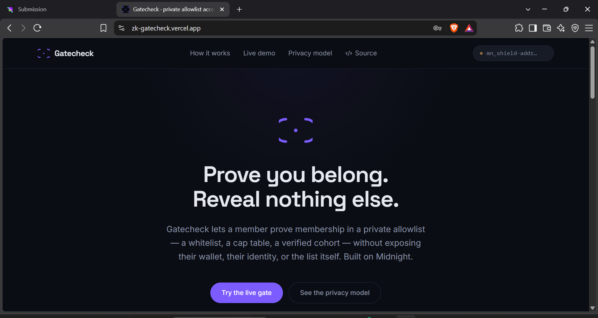
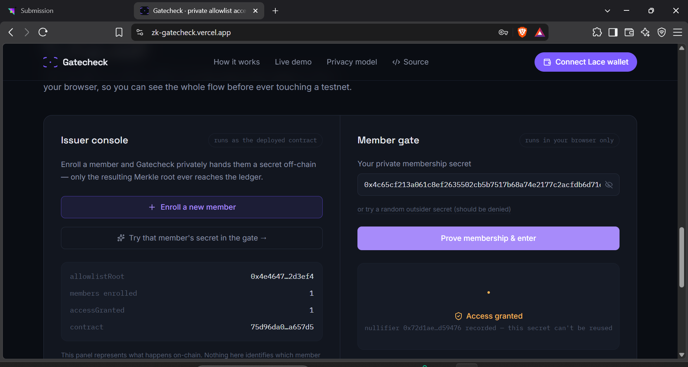
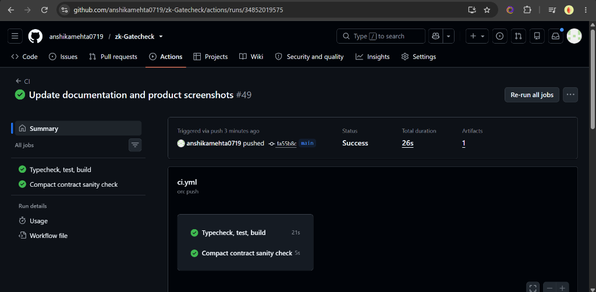

# Gatecheck

[](https://github.com/anshikamehta0719/zk-Gatecheck/actions/workflows/ci.yml)
[](https://github.com/anshikamehta0719/zk-Gatecheck/actions/workflows/deploy.yml)


> **Prove you belong to a private allowlist — without revealing who you are, which wallet you hold, or who else is on the list.**

Built on **Midnight** for the **Midnight Builder Challenge — Level 4 (Waxing Gibbous)**.

---

## ⚡ Quick Links

- 🌐 **Live dApp:** [https://zk-gatecheck.vercel.app/](https://zk-gatecheck.vercel.app/)
- 🎬 **Demo Video:** [Watch Walkthrough (Google Drive)](https://drive.google.com/file/d/1M4d0wrOpUMhxW5WXRLGZL3Tp7azQBqZH/view?usp=sharing)
- 📖 **Documentation:** [Usage Guide](./docs/USAGE.md) · [Architecture Spec](./docs/ARCHITECTURE.md)

---

## 📜 Deployed Contract Address (Preprod)

| Parameter | Details |
|---|---|
| **Network** | Midnight Preprod Testnet |
| **Contract Address** | [`0x75d96da09aa9414d760770592351106e8473e6cc1d65edf73c2e39d37ba657d5`](https://preprod.midnightexplorer.com/contracts/0x75d96da09aa9414d760770592351106e8473e6cc1d65edf73c2e39d37ba657d5) |
| **Explorer Verification** | [https://preprod.midnightexplorer.com/contracts/0x75d96da09aa9414d760770592351106e8473e6cc1d65edf73c2e39d37ba657d5](https://preprod.midnightexplorer.com/contracts/0x75d96da09aa9414d760770592351106e8473e6cc1d65edf73c2e39d37ba657d5) |
| **Deploy Transaction** | `1e9d37f77f0e782e108e80dbe2f5fdcc568f5b5ec3941ae8f62d09b0d1d2bb55` |
| **Block Height** | `2544554` (`b07546b7cf731dc7881bf24b346b7e276bc3530cfda3d002a1b1f2febc3519c4`) |
| **DUST Registration Tx** | `00f0ae7a402100104a99a2eb4329f5b1ea8ed5ffc9b6a8a85d9513fd53dc24555c` |

**Verify via Midnight GraphQL Indexer:**
```bash
curl -X POST https://indexer.preprod.midnight.network/api/v4/graphql \
  -H "Content-Type: application/json" \
  -d '{"query":"{ contractAction(address: \"75d96da09aa9414d760770592351106e8473e6cc1d65edf73c2e39d37ba657d5\") { address transaction { hash block { height timestamp } } } }"}'
```

---

## 📸 Application Preview

### 1. Landing Page & Wallet Connection

* **Zero-Knowledge Gating Interface:** Modern dark-mode dApp with Midnight Lace wallet connectivity.
* **Privacy-First Design:** Clear onboarding showing how users prove access without exposing their wallet or identity.

---

### 2. Interactive Issuer Console & Member Gate

* **Issuer Console:** Generates cryptographic member credentials off-chain and registers the 32-byte Merkle root on Midnight.
* **Member Gate:** Proves membership client-side using local zero-knowledge witness derivation and records a one-time nullifier to guarantee Sybil resistance without identity disclosure.

---

## 🔒 How It Works & Privacy Model

Traditional token gates expose user identities by cross-referencing public wallet addresses against an on-chain allowlist. **Gatecheck** separates *eligibility* from *identity*:

1. **Issuer Commitment:** The issuer builds an off-chain Merkle tree of member secrets and commits only a single **32-byte root** to the Midnight contract. The underlying member list is never exposed on-chain.
2. **Client-Side ZK Proving:** A member enters their private secret into the browser. The client derives the Merkle witness locally and produces a zero-knowledge proof.
3. **Sybil-Resistant Nullifiers:** The contract registers a deterministic **nullifier** upon successful entry, preventing double-use while ensuring the member's wallet and secret remain completely unlinkable.

| Visibility | Elements | Cryptographic Role |
|---|---|---|
| **Public (On-Chain)** | `allowlistRoot`, `nullifiers`, `accessGranted`, `issuer` | Verifies membership proofs, blocks replays, tracks usage count |
| **Private (Client-Side)** | `secretKey`, `merklePath`, `pathDirections`, member identity | Kept exclusively on user device; never sent over network or stored on ledger |

---

## 🛠️ Tech Stack & Architecture

| Layer | Technology | Purpose |
|---|---|---|
| **ZK Smart Contract** | [Compact 0.31.1](https://docs.midnight.network) | Confidential shielded-state logic (`contracts/gatecheck.compact`) |
| **Network** | Midnight Preprod | Privacy-first zero-knowledge smart contract blockchain |
| **Off-Chain Logic** | TypeScript, `@noble/hashes` | SHA-256 Merkle tree construction and witness derivation |
| **Frontend** | React 19, TypeScript, Vite | Client-side proving interface and wallet provider |
| **Styling** | Tailwind CSS v4, Lucide Icons | Responsive dark-mode interface |
| **Testing & CI/CD** | Vitest, GitHub Actions | Automated unit tests and automated Preprod deployment |

---

## ⚙️ Automated CI/CD Pipeline



Every commit to `main` runs automated GitHub Actions workflows:
- **Typecheck, Test, & Build:** Verifies TypeScript types, executes unit tests, and compiles the production web build.
- **Compact Contract Check:** Sanity-checks and validates the confidential smart contract logic in [`contracts/gatecheck.compact`](./contracts/gatecheck.compact).

---

## 💻 Local Setup & Testing

```bash
# 1. Clone repository
git clone https://github.com/anshikamehta0719/zk-Gatecheck.git
cd zk-gatecheck

# 2. Install dependencies
npm install

# 3. Start development server
npm run dev
# → Open http://localhost:5173

# 4. Run test suite
npm test

# 5. (Optional) Generate an off-chain allowlist
npm run generate-allowlist -- --count 100
```

---

## 🏆 Level 4 Submission Checklist

- [x] **Working MVP live on Preprod:** [zk-gatecheck.vercel.app](https://zk-gatecheck.vercel.app/)
- [x] **Verifiable Contract Address:** [`0x75d96da09aa9414d760770592351106e8473e6cc1d65edf73c2e39d37ba657d5`](https://preprod.midnightexplorer.com/contracts/0x75d96da09aa9414d760770592351106e8473e6cc1d65edf73c2e39d37ba657d5)
- [x] **Midnight Explorer Proof:** [Preprod Explorer Verification](https://preprod.midnightexplorer.com/contracts/0x75d96da09aa9414d760770592351106e8473e6cc1d65edf73c2e39d37ba657d5)
- [x] **Documentation:** Setup instructions + [`docs/USAGE.md`](./docs/USAGE.md) + [`docs/ARCHITECTURE.md`](./docs/ARCHITECTURE.md)
- [x] **CI/CD Pipeline Running:** [GitHub Actions Workflows](https://github.com/anshikamehta0719/zk-Gatecheck/actions)
- [x] **Product X Profile:** [@zk_gatecheck](https://x.com/zk_gatecheck)
- [x] **Demo Video:** [Watch Walkthrough (Google Drive)](https://drive.google.com/file/d/1M4d0wrOpUMhxW5WXRLGZL3Tp7azQBqZH/view?usp=sharing)
- [x] **Minimum 15 Commits:** 50+ commits on `main`

---

## License

MIT License — see [`LICENSE`](./LICENSE).
